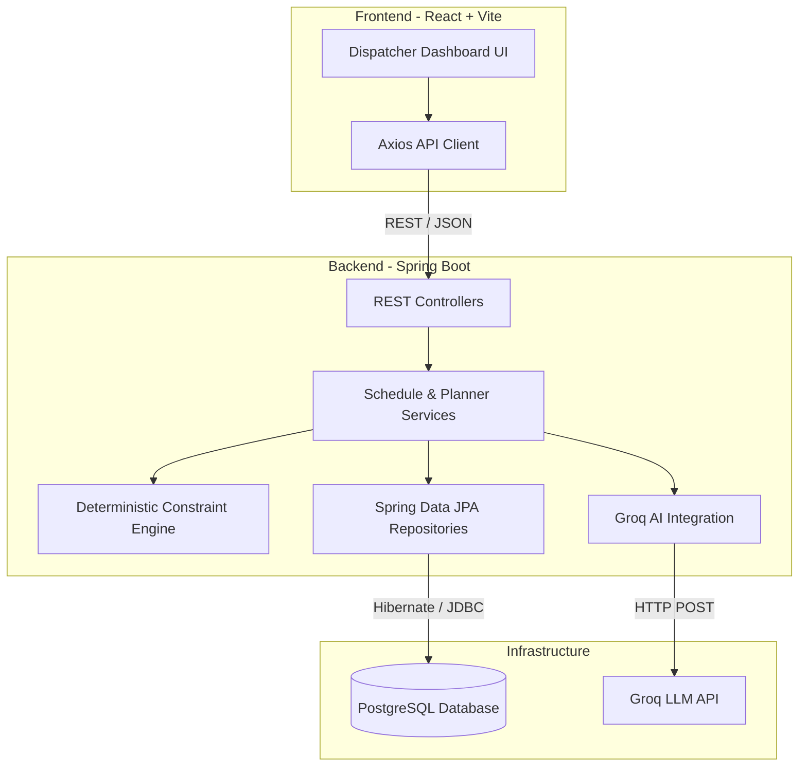
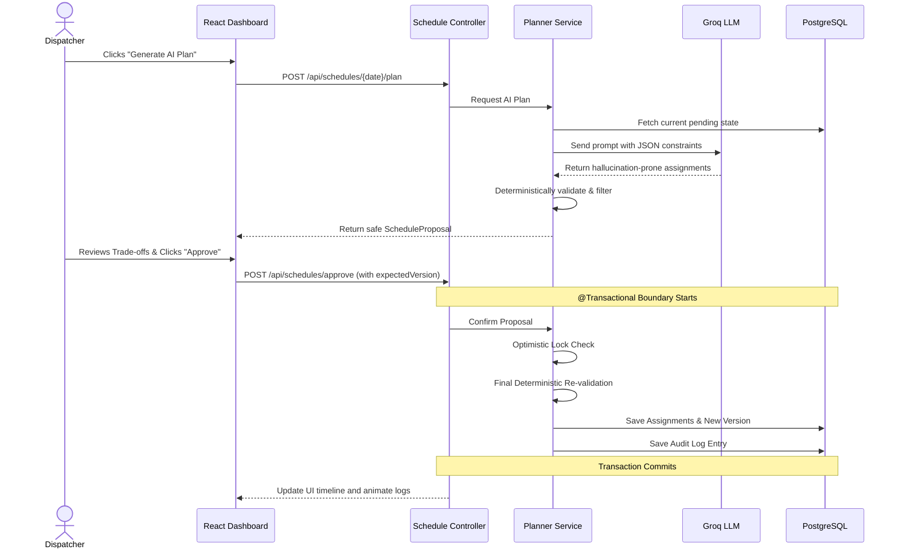

# Field Service Dispatch & Replanning Agent

## Setup & Execution

### Prerequisites
- Docker & Docker Compose
- Java 21
- Node.js & npm

### Running the Application
1. **Start the Database (PostgreSQL)**
   ```bash
   docker-compose up -d
   ```
2. **Start the Backend (Spring Boot)**
   ```bash
   cd backend
   ./mvnw spring-boot:run
   ```
   *The database will be automatically seeded with technicians and service requests.*
3. **Start the Frontend (React + Vite)**
   ```bash
   cd frontend
   npm install
   npm run dev
   ```
4. **Access the Dashboard**
   Open `http://localhost:5173/` in your browser.

## Architecture

This is a modular monolith adhering strictly to clean coding principles and a feature-driven architecture.

### High-Level System Architecture



### Request Flow (AI Planning & Approval)

The entire application enforces a strict safety boundary: **AI proposes -> deterministic engine validates -> human approves -> transactional backend confirms -> audit history records the change.**



## Completed Scope
- Setup of a scalable feature-driven architecture on both Frontend and Backend.
- Implementation of the `ConstraintValidator` that deterministically checks hard constraints (overlap, skill, region, workload, availability).
- Implementation of the `PlannerService` (AI scheduling algorithm) that prioritizes emergencies and balances workload.
- Implementation of the `ScheduleService` that uses transaction bounds and optimistic locking (`expectedBaseVersion`) to prevent race conditions and Stale Schedules.
- Fully automated test suite for the Constraint Engine and Transaction Boundaries using JUnit 5 and Mockito.
- A fully functional Dispatcher Dashboard UI containing:
  - Visual Schedule Timeline mapping assignments horizontally.
  - AI Proposal Panel indicating trade-offs, unassigned requests, and risks.
  - Approval flow triggering the transactional backend endpoints.

## Excluded Scope / Limitations
- **Idempotency Service:** Not fully implemented yet via Redis as per requirement 12, though Optimistic Locking prevents dirty writes.
- **Version History View:** The UI does not yet have a dedicated panel to diff versions (e.g. Added/Removed/Moved visualization).
- **Authentication:** Intentionally omitted per prompt rules to keep scope bounded.

## Tests
Unit tests are located in `backend/src/test/java/com/example/dispatch/`. They extensively test the `ConstraintValidator` against overlapping intervals, workload limits, and back-to-back assignment edges. The `ScheduleServiceTest` uses Mockito to verify the atomic rollback behavior when the AI proposes an invalid schedule. Run them with:
```bash
./mvnw test
```

